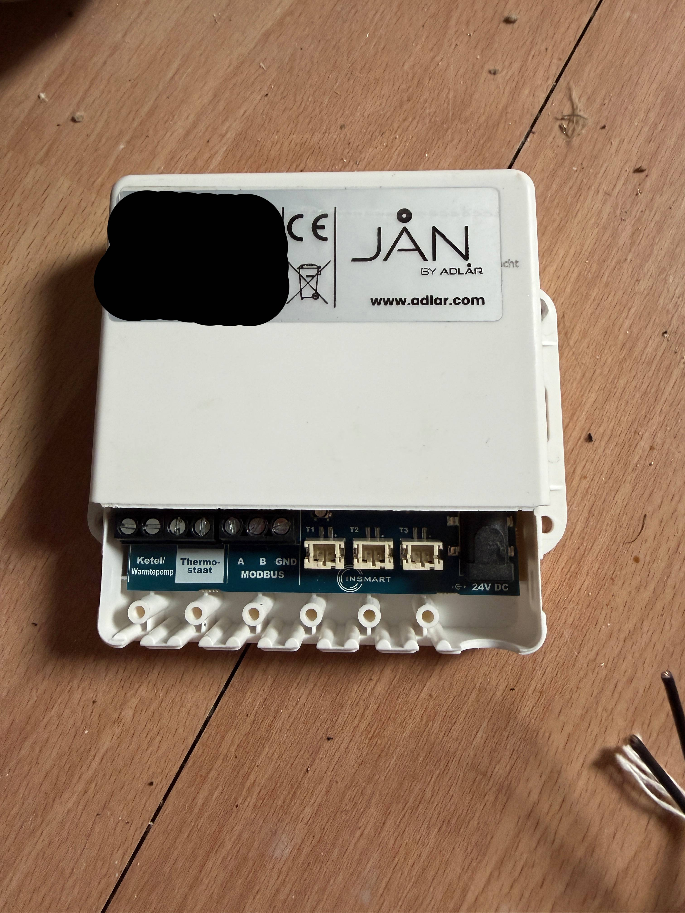
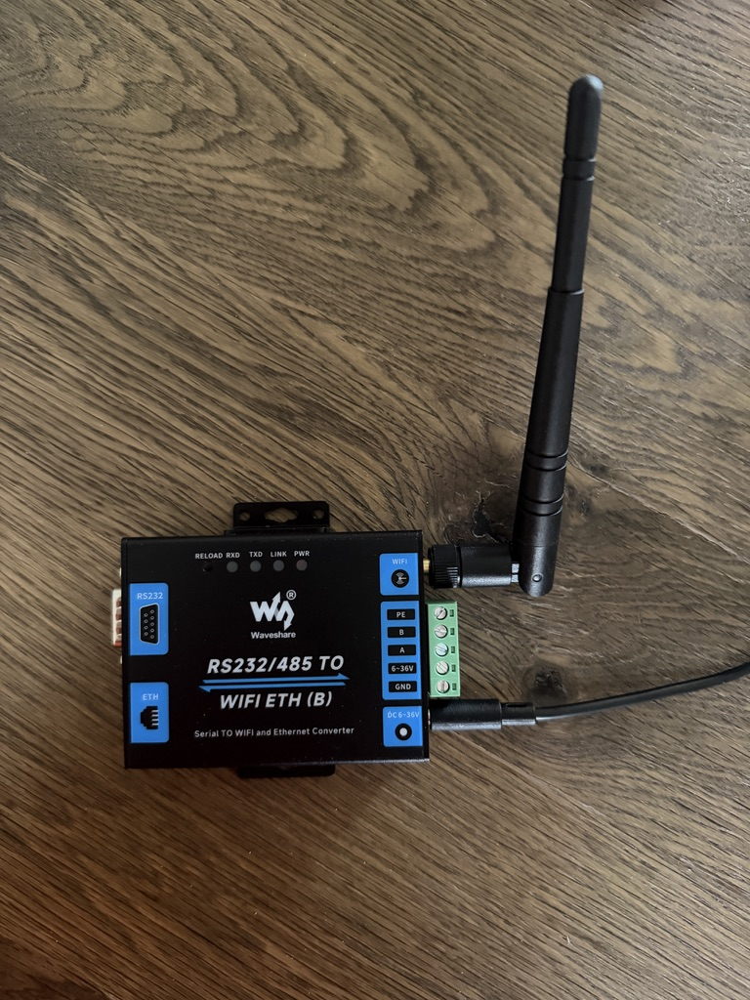
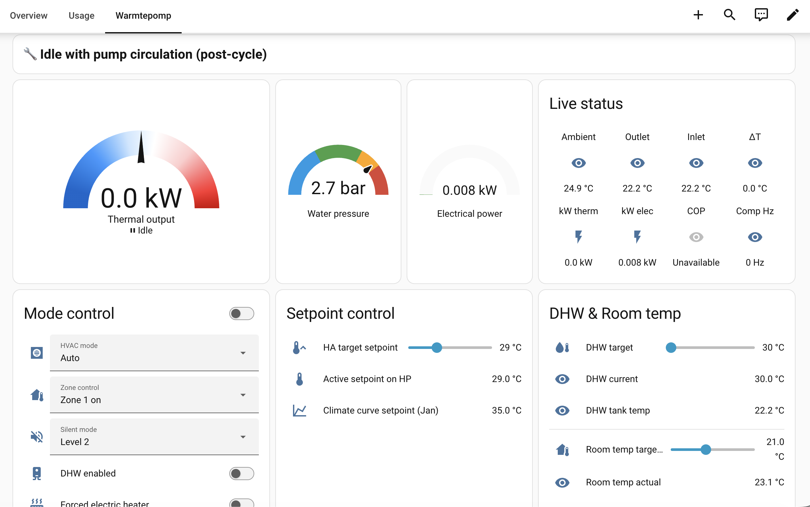
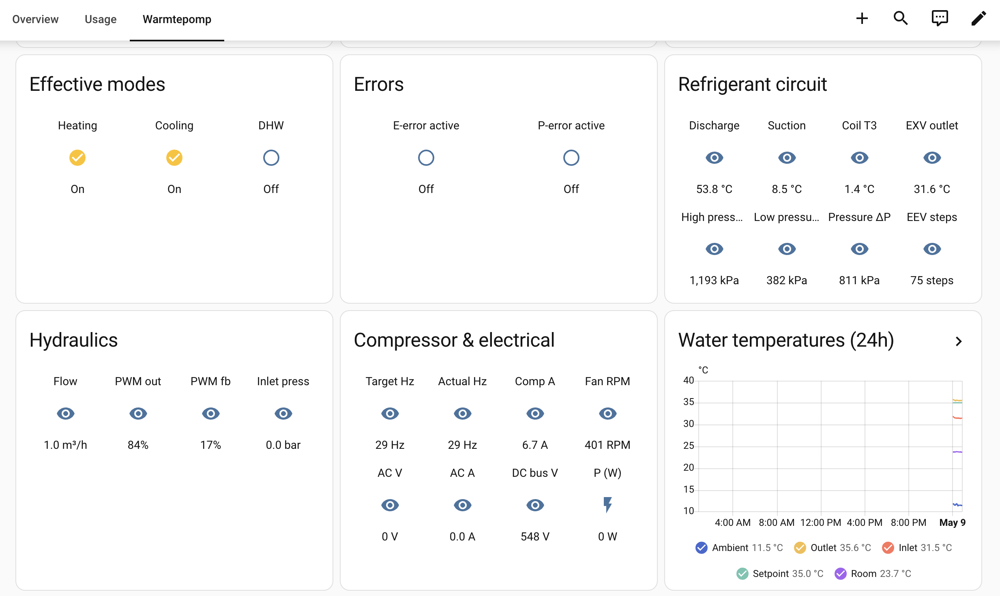
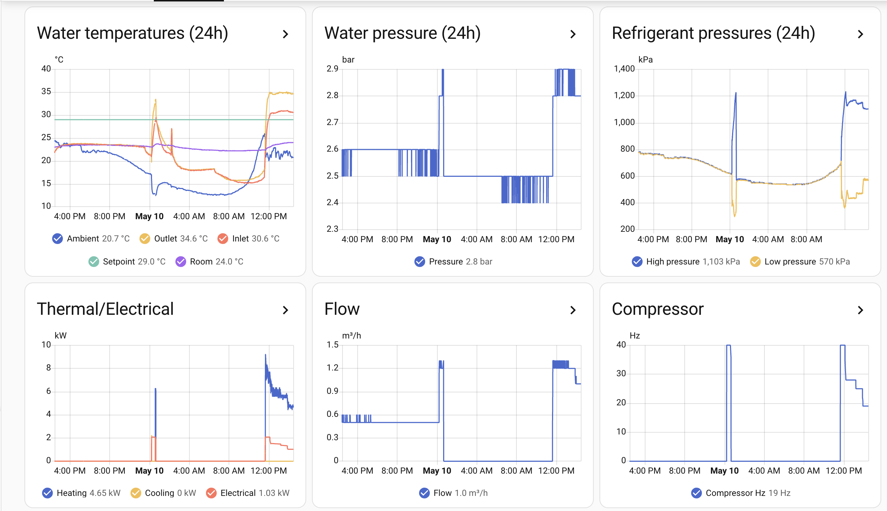
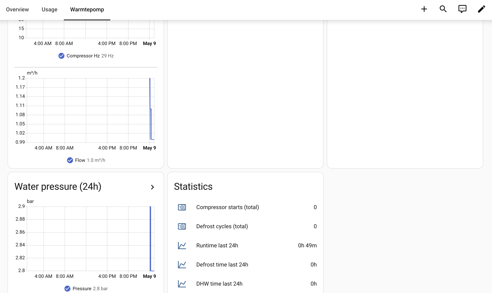

# Adlar Aurora III Pro — Home Assistant Modbus Integration

Complete Home Assistant integration for the **Adlar Castra Aurora III Pro** heat pump (R290 series, 7 kW, 9 kW, and 12 kW models) via a Modbus TCP-to-RTU gateway. Provides full read access to all internal sensors and bidirectional control over key parameters.

> ⚠️ **This is a community integration, not an official Adlar product.** Use at your own risk. Modifying the Modbus bus on your heat pump may affect your warranty — check with Adlar support first.

## Features

- **45+ sensors** covering all aspects of the heat pump:
  - Water and refrigerant circuit temperatures (inlet, outlet, buffer, DHW tank, discharge, suction, EXV outlet, ambient, coil)
  - Hydraulics (water flow, inlet/outlet pressure, pump PWM)
  - Compressor (target & actual frequency, current, EEV opening, fan RPM)
  - Electrical (AC voltage, AC current, DC bus voltage)
  - System pressures (high/low side in kPa)
  - Status bits (defrost, anti-freezing, oil return, disinfection)
  - Climate curve outputs, valve positions, error codes
- **Live calculated values**:
  - DeltaT, thermal power output (kW)
  - Apparent electrical power and live COP (only on units where AC voltage/current registers are populated — see caveats)
  - Pressure delta, outlet-ambient delta
- **Bidirectional control**:
  - Zone 1 heating setpoint
  - DHW setpoint and on/off
  - Room temperature setpoint
  - HVAC mode (heating/cooling/auto), zone control, silent mode
  - Forced electrical heater
- **Counters and history**:
  - Compressor starts (per hour)
  - Defrost cycles (per day)
  - Runtime, defrost time, DHW time tracking
- **Notifications** for water pressure issues and E/P error codes

## Hardware Requirements

| Component | Notes |
|---|---|
| Adlar Castra Aurora III Pro | 7 kW, 9 kW, or 12 kW R290 model |
| Waveshare RS232/485 to WiFi/ETH (B) | Modbus TCP-to-RTU gateway, ~€30 |
| 2× shielded twisted pair wire | For RS485 A/B, plus optionally GND |
| 12V DC power supply (for non-PoE Waveshare) | 5.5/2.1mm jack |

The Waveshare unit is connected in **parallel** to the existing Jan-module on the heat pump's internal RS485 communication bus. RS485 is a multi-drop bus, so adding another listener/master is electrically supported.

## Wiring

The Waveshare connects to the **MODBUS A / B / GND** screw terminals on the Jan-module. These are the same RS485 pair the Jan itself uses to talk to the heat pump's main board, so you are simply tapping in as an additional node on the bus.

| Waveshare terminal | Jan-module terminal | Notes |
|---|---|---|
| `A` | `MODBUS A` | RS485 differential A |
| `B` | `MODBUS B` | RS485 differential B |
| `GND` | `MODBUS GND` | Optional but strongly recommended for noise immunity |
| `6-36V` + `GND` | — | Power input (use a 12V DC supply, or PoE if you have the PoE variant) |
| `PE` | — | Protective earth, leave disconnected unless your installation calls for it |

Use a single shielded twisted pair for A/B (don't split A and B across different pairs — it will pick up noise and you'll see frame decode errors). Add a third conductor for GND if you have one.

### Jan-module — terminal layout

The lower terminal block on the Jan-module exposes the MODBUS bus. Wire into the three terminals labelled `A`, `B`, `GND` under "MODBUS":



### Waveshare RS232/485 to WiFi/ETH (B) — terminal layout

The green plug on the right side carries (top to bottom) `PE`, `B`, `A`, `6-36V` (power +), `GND`. Power can also be supplied via the DC barrel jack:



> ⚠️ Always make wiring changes with the heat pump and Waveshare powered off. Double-check A/B polarity before powering back on — swapping A and B is the most common cause of "no response" or frame decode errors.

## Waveshare Gateway Configuration

Connect to the Waveshare's web interface (default `http://10.10.100.254` in AP mode, `admin`/`admin`) and configure:

### UART Settings
- **Mode**: Modbus TCP <=> Modbus RTU
- **Baud rate**: 9600
- **Data bits**: 8
- **Parity**: None
- **Stop bits**: 2 (important — not 1)
- **Baud rate adaptive (RFC2117)**: Disable

### Network Settings
- **Mode**: Server
- **Protocol**: TCP
- **Port**: 8899
- **TCP Timeout**: 300
- **Max TCP connections**: 4
- **Password authentication**: Disable

### WiFi Settings
- Set to **STA mode** with your home WiFi credentials
- Use **DHCP** but assign a static IP reservation in your router

### Other
- **MQTT**: Disable
- **Ethernet ports**: Disable (unless you're using Ethernet)

## Installation

### 1. Configure Home Assistant packages

If you don't already use packages, add this to your `configuration.yaml`:

```yaml
homeassistant:
  packages: !include_dir_named packages
```

### 2. Place the package file

```bash
mkdir -p /config/packages
cp adlar_heatpump.yaml /config/packages/
```

### 3. Update the IP address

Open `adlar_heatpump.yaml` and replace `10.57.16.59` with your Waveshare's IP address.

### 4. Validate and restart

In HA: **Developer Tools → YAML → Check Configuration**

If green, restart Home Assistant. Within a minute you should see `sensor.hp_*` entities populated with live values.

## Sample dashboard

A ready-to-use **section** is provided in [dashboard_section_sample.yaml](dashboard_section_sample.yaml). It is a single section, not a whole view/page, and is meant to be dropped into an existing **Sections**-layout view on your dashboard. It groups all the integration's entities into logical cards: a status banner, a bidirectional thermal-power gauge, water pressure / electrical power gauges, live status, mode and setpoint controls, DHW, status indicators, refrigerant circuit, hydraulics, compressor & electrical, and 24-hour history graphs.

### How to use it

1. Open your dashboard, click the **pencil (edit)** icon, then **+ Add view** (or open an existing view) and choose **Sections** as the view layout.
2. With the view open in edit mode, click the **three-dots menu → Edit dashboard configuration** (or, on older HA versions, "Raw configuration editor").
3. Find the view you just created in the YAML and paste the contents of `dashboard_section_sample.yaml` as a new entry under that view's `sections:` list. The pasted block already includes its own `cards:` and `column_span: 4`, so it slots in directly.
4. Save and exit edit mode.

> ⚠️ **HACS dependency:** the bidirectional thermal-power gauge at the top of the section uses [`gauge-card-pro`](https://github.com/benjamin-dcs/gauge-card-pro). Install it from HACS first (HACS → Frontend → Search "Gauge Card Pro") or that card will render as "Custom element doesn't exist: gauge-card-pro". The rest of the section uses only built-in cards and works without HACS.






> ℹ️ The COP graph above appears empty because this unit is affected by the AC voltage/current firmware issue (see [Important Caveats](#ac-voltage-and-current-registers-may-not-work--cop-unavailable-on-some-units)). On units where registers 74/75 work, the COP graph will populate.

The dashboard relies on the `input_number` and `input_boolean` helpers defined in the package (target setpoint, DHW target, room temp target, DHW enabled, forced electric heater) — these are created automatically when the package is loaded.

## Important Caveats

### The "two captains" problem with the Jan-module

The Jan-module is the master that controls the Aurora's setpoint via register `2107` based on its weather-compensation curve. If you write to `2107` from HA, the Jan will likely overwrite your value within seconds.

**Workarounds**:

1. Contact Adlar support to disable the weather-compensation curve on the Jan-module so it becomes a passive monitor. This makes HA the only master writing to 2107.
2. Use HA only for monitoring (read-only) and let the Jan handle setpoints.
3. Schedule HA writes during periods when the Jan is less active.

### Register 2114 (room temperature setpoint)

This register exists in the official protocol documentation but its actual behavior depends on whether your unit is configured "with thermostat" mode (register 3X0001). On units with an external thermostat (Honeywell, Nest), register 2114 may be ignored. **Test carefully** before relying on it for automations.

### Slave ID

The official protocol specifies **slave ID 251** (`0xFB`), but many users find that **slave 1** also works empirically. This package uses slave 1 by default. If you experience instability or no response, try changing `slave: 1` to `slave: 251` throughout the file.

### AC voltage and current registers may not work — COP unavailable on some units

> ⚠️ **Known issue, not a bug in this package.**

Registers `3X0074` (AC input voltage) and `3X0075` (AC input current) are documented in the official Adlar Modbus protocol point list, but **do not return data on at least some firmware revisions** of the Aurora III Pro. They simply return `0` even while the compressor is running.

Verified on at least one Aurora III Pro (mid-2025 firmware) where:
- Register 76 (DC bus voltage) reports correctly (e.g. 544V)
- Register 77 (compressor current) reports correctly (e.g. 6.7A)
- Register 79 (compressor frequency) reports correctly
- **Registers 74 and 75 stay at 0**, even with the compressor at 29 Hz

As a result, the `sensor.hp_electrical_power` and `sensor.hp_cop` sensors will stay at `0` and `unavailable` respectively on affected units.

This is a firmware-level limitation in the heat pump itself, not something this integration can work around. The registers are kept in the package because:
- They work on some units (please [open an issue](../../issues) if they do for you, with your firmware revision)
- A future Adlar firmware update may enable them
- Removing them would require all users to re-add when fixed

**Workarounds for accurate power measurement:**

1. **Install a proper kWh meter** — Shelly EM with current clamp on the heat pump circuit (~€40), a P1 sub-meter, or a Modbus DDS238. This is the only way to get true active power (with power factor) for accurate COP calculations.
2. **Estimate from compressor frequency** — at ~50W per Hz this is a rough but plausible approximation. Add a custom template sensor if you want this without buying hardware.

**To check whether your unit is affected**, run the diagnostic Python script in the [Troubleshooting](#troubleshooting) section below and observe registers 74 and 75 while the compressor is running.

### Note on apparent vs true power

Even if registers 74 and 75 work on your unit, `V × A` is *apparent* power, not *true* active power. It ignores power factor, which on inverter-driven heat pumps can be 0.7-0.9. A proper kWh meter remains the most accurate solution for COP.

### Temperature scale inconsistency

The official Adlar documentation is inconsistent in stating `123 means 12.3 °C` vs `123 means 123 °C` for different registers. This package uses `scale: 0.1` for all temperature registers, which has been empirically verified to work for register 2107. If a temperature value appears off by a factor of 10, adjust the `scale` for that specific sensor.

## Modbus Protocol Reference

This integration is based on the official Adlar Modbus protocol point list:

- **Connection**: RS-485 ModbusRTU
- **Slave address**: 251 (officially)
- **Baud rate**: 9600 bps
- **Frame format**: 8N2 (8 data bits, no parity, 2 stop bits)
- **Checksum**: CRC-16 (Modbus standard)
- **Function codes supported**: 0x03, 0x04, 0x06, 0x10
- **3X registers**: read-only (input registers, FC 0x04)
- **4X registers**: read/write (holding registers, FC 0x03/0x06/0x10)

A summary of the most useful registers used in this package:

| Register | Type | Description |
|---:|:--:|---|
| 38 | input | System status bitfield |
| 40 | input | Room temperature (Tidr) |
| 42 | input | Inlet water temperature (TA) |
| 43 | input | Outlet water temperature (TB) |
| 46 | input | DHW tank temperature (TW) |
| 50 | input | Ambient temperature (T4) |
| 52 | input | Discharge temperature (TP) |
| 53 | input | Suction temperature (TH) |
| 61 | input | Outlet water pressure |
| 64 | input | Water flow |
| 70 | input | EEV opening (steps) |
| 72 | input | Fan speed (RPM) |
| 74 | input | AC voltage |
| 75 | input | AC current |
| 79 | input | Compressor actual frequency |
| 86 | input | High pressure (kPa) |
| 87 | input | Low pressure (kPa) |
| 2100 | holding | HVAC mode (1=cool, 2=heat, 4=auto) |
| 2101 | holding | Zone control (0/1/2/3) |
| 2102 | holding | DHW on/off |
| 2103 | holding | Function A (silent mode + heater + disinfection) |
| 2105 | holding | DHW setpoint |
| 2107 | holding | Zone 1 heating setpoint |
| 2114 | holding | Room temperature setpoint |

For the complete register map, see the Adlar Aurora III installation manual or contact Adlar support.

## Troubleshooting

### Frequent timeouts in Home Assistant logs

- Verify Waveshare UART settings (especially **stop bits = 2**)
- Check that A and B wires are not swapped
- Make sure you used a single twisted pair for A/B (not two separate wires from different pairs)
- Consider adding a GND connection between Waveshare and the heat pump's RS485 bus reference

### "Connection: Not connected" errors

- Verify the Waveshare is reachable: `ping <waveshare-ip>`
- Check WiFi signal strength in your router; consider an Ethernet connection or moving the AP closer
- Power-cycle the Waveshare (some firmwares hang under stress)

### Frame decode errors / corrupt data

- Indicates electrical/physical issues on the RS485 bus
- Re-terminate the wires with fresh ferrules
- Verify A/B polarity (try swapping at the Waveshare side)
- Add a 120Ω termination resistor between A and B at the bus end
- Add a GND wire if not already present

### Setpoint writes don't stick

This is the "two captains" issue described above. The Jan-module overwrites your value. See the caveats section.

### Diagnostic script: dump all registers

To check which registers are populated on your unit (useful for verifying the AC voltage/current issue, or finding firmware differences), use [tools/dump_registers.py](tools/dump_registers.py). It reads the documented registers directly and prints them in a table you can compare against the Adlar documentation.

```bash
pip3 install pymodbus
python3 tools/dump_registers.py <WAVESHARE_IP> 8899 1
```

Arguments are optional and default to `10.57.16.59`, port `8899`, slave `1`. If you get no response, try slave `251`.

Run this while the compressor is actively running. If registers 74 and 75 return 0 while 76 and 77 return real values (e.g. 544 and 67), your unit is affected by the firmware issue described in the caveats.

If you get different results than reported here, [please open an issue](../../issues) with your firmware revision so we can document which units do and don't expose AC voltage/current.

## Credits

- Original Modbus mapping work and HA package structure: **Onno Timmermans** ([github.com/OnnoTimmermans/HA-modbus-Adlar-aurora-Pro-III](https://github.com/OnnoTimmermans/HA-modbus-Adlar-aurora-Pro-III))
- Extended with the complete register set from the official Adlar Modbus protocol documentation
- Bug fixes for current Home Assistant Modbus syntax (number platform, template select, bitwise_and as function)

## Contributing

Found an issue or have a register that's not yet mapped? PRs welcome! Especially valuable:

- Confirming behavior of register 2114 (room temperature setpoint) on different unit configurations
- Verified scale factors for the zone temperature limits (registers 10-29)
- Decoded error code mappings (E01-E96, P01-P96 bit assignments)
- Reports of which slave ID works on which firmware revision

## License

MIT — see `LICENSE` file.

## Disclaimer

This integration is provided as-is. The author is not affiliated with Adlar Castra B.V. or any of its subsidiaries. Modifying the Modbus communication on your heat pump:

- May void or affect your manufacturer warranty
- Should ideally be done with the knowledge of Adlar support
- Requires basic understanding of RS485 wiring and Home Assistant configuration
- Carries small but real risk of disrupting heat pump operation if done incorrectly

Always make modifications with the heat pump powered off, and have a documented way to revert your changes.
